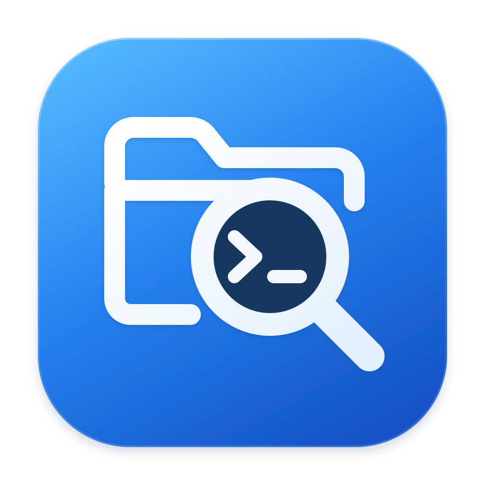
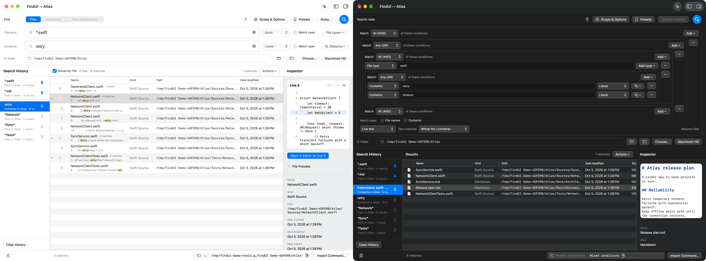

# FindUI

FindUI is a macOS GUI for command-line file searches. Despite there being many "file search apps", none that I found could do the CLI-focused stuff that I wanted, which is basically:

- I _would_ search in the terminal because it is fast and precise, but I can't remember every single flag for fd, rg, and the like
- With FindUI, I can construct it with the precise filters in the GUI, and then export it as a command I can run in the terminal as well as viewing the file search in the GUI
- I can also input `fd`, `rg`, or `find` commands with their full tool options, including options without GUI controls. Recognized searches display file results; other forms display the command's text output or error. See [command import](docs/command-import.md).
- So essentially, I built this app as a bridge between GUI and CLI. Every search in the GUI can be expressed as a CLI command, and all exported searches can be re-imported into the GUI.

That said, I have taken steps to make it the best GUI app for my purposes, and I consider it quite a capable GUI on its own. It has features like:

- Simple searches with **fd**, **ripgrep**, and **fzf**, plus other tools like libarchive, Tika, Spotlight search, custom content search backends for various file types
- File indexing for speedups (like Everything on Windows); plus I tried to optimize the speed of all searches
- Saved searches and presets, easy built-in regexes and filetypes (like "all image files")
- Arbitrarily complex searches with nested conditions, things like "I want any image format over 100MB, OR a .docx document with the word 'stuff' inside from April or May 2025", etc
- AI search (give a natural language description and have AI convert it into a precise command, without any rigid syntax), which is possible because there is a one-to-one mapping with CLI. You can use any model (including local) from an OpenAI-compatible API, or from ChatGPT sign in, but you have to provide this yourself.
- macOS integration, like QuickLook, macOS tags, native tabs and windows in the interface, light and dark mode, terminal and finder integration (quick navigation). It's a native macOS app, liquid glass for macOS >= 26, it is small and performs well.
- It's FOSS, under the [MIT license](LICENSE)! I wouldn't want to have a proprietary black-box app just for file search where the backend is already available in CLI. Bundled dependencies retain their own licenses, included with the app.

## Install

Download the app ZIP from [Releases](https://github.com/procrastinine/findui/releases/latest), unzip it, and move **FindUI.app** to Applications. Requires **Apple Silicon and macOS 14+**. Core search works without Homebrew, compilers, or extra tool installations.

I am not going to pay Apple for a Developer account, so this is ad-hoc signed and not notarized. If macOS blocks it, use **System Settings → Privacy & Security → Open Anyway** after verifying its source. See [installation and optional readers](docs/installation.md).

## Try a search

1. Choose **In folder**.
2. Enter `*.swift` in **Filename** and `timeout` in **Contents**.
3. Preview a match in the inspector, or click the command in the footer to copy it.

Leave either field empty to search only names or contents. **Rules** supports nested AND/OR/NOT groups mixing file and content conditions. **Scope & Options** adds filters such as dates, sizes, paths, and Finder tags.

Save searches as presets, revisit history, or refine existing results. Document conversion, archive expansion, prepared indexes, and AI search are optional; ordinary searches stay local.

## Documentation

- [Search guide](docs/search-guide.md) — controls, nested rules, presets, results, and indexes.
- [Documents and archives](docs/documents-and-archives.md) — supported formats, readers, and caching.
- [Command line](docs/command-line.md) · [Command import](docs/command-import.md) · [AI search](docs/ai-search.md).
- [Build, test, and release](docs/development.md) — development, packaging, screenshots, and publication checks.
- [Architecture](docs/search-architecture.md) · [Performance](docs/search-performance.md) · [Backend choices and alternatives](docs/backend-selection.md).
